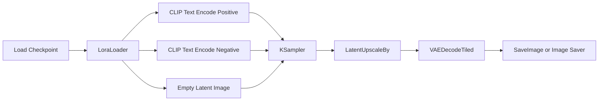
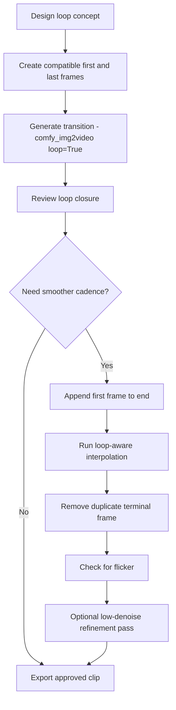

# ComfyUI for projection-mapping textures (owner-supplied research, 2026-07)

Preserved research document — the methodology behind the projection tools.
Read projection-mapping.md + projection-styles.md for this deployment's
specifics; this file is the general doctrine.

## Executive summary

The highest-yield workflow is NOT "generate at final delivery size": generate
at a compositionally stable working size, lock style and structure, then
upscale/decode/export projection-first. Use core sampling controls (seed,
steps, CFG, sampler, scheduler, denoise) for repeatability, tiled VAE decode
for large outputs, and export masters separately from playback proxies.

Strong default: develop the look at ~1024² (or 1536×768-class for wide) for
stills, 512–1024-class for loop development; choose one approved **seed
family**; keep denoise conservative when refining; latent-upscale then tiled
decode; keep lossless PNG masters and derive delivery formats afterwards.
(This deployment: `comfy_txt2img(hires_scale=...)` is the latent-upscale path;
`comfy_master_still` produces the delivery jpg.)

Perfect loops are designed for closure from the start, not "fixed" at the
end: closed first/last-frame generation (`comfy_img2video(loop=True)`),
stable conditioning with minimal per-frame randomness, and loop-aware
interpolation that explicitly bridges last→first (`comfy_loop_video
(interpolate_fps=...)`).

Originality is structural, not a magic prompt: vary structure, material,
lighting, color, and motion **independently**; prompt for physical behaviors
and surface logic instead of trend bundles; use LoRAs as selective modifiers,
not identity replacements.

## Baseline settings (projection-minded starter matrix)

Build the source at the aspect ratio of the mapped object. Control meanings
are official KSampler semantics; the combinations are practical defaults.

| Goal | Sampler + scheduler | Steps | CFG | Seed strategy | Denoise |
|---|---|---:|---:|---|---:|
| Look-dev, still textures | DPM++ 2M + Karras | 20–28 | 5.0–7.0 | sweep 8–16 seeds, prompt fixed | 1.00 |
| Final still refinement | DPM++ 2M SDE + Karras | 24–36 | 4.5–6.5 | lock one approved seed | 0.20–0.40 |
| Stylized abstract | Euler or DPM++ 2M + Karras | 16–26 | 4.0–6.0 | sweep, then lock | 1.00 → 0.25 second pass |

Rules that pay:
- Still textures: denoise ≈1.0 first pass, **0.15–0.45 refinement** (same
  seed + same prompt via `comfy_img2img` — the "refine recipe").
- Don't overdrive CFG for quality — it degrades; use the low-denoise second
  pass instead.
- Animated refinement wants lower CFG and lower denoise than still ideation
  (temporal stability > maximal novelty).
- Memory levers: latent upscale (`hires_scale`) instead of huge first passes;
  `VAEDecodeTiled` (tile_size 768–1024, overlap 64–128) for large decodes.

The robust general pattern:

## Pipeline recipes

### Photoreal material texture (stone, plaster, oxidized metal, bark, worn concrete)
For surfaces that survive close projection without looking like AI wallpaper.
- SDXL base + a detail LoRA **sparingly** (`add-detail-xl`, start 0.6–1.0 —
  lower than the card's 1.5 default; projector optics soften, but over-busy
  microcontrast shimmers at throw distance).
- Positive shape: `aged limewash wall, mineral bloom, fine cracks, subtle
  stains, hand-applied plaster, diffuse skylight, physically plausible
  surface, no focal object, no text, texture plate`
- Negative: `face, character, logo, lettering, frame, border, composition
  center, dramatic perspective, glossy CGI, over-sharpened microdetail,
  watermark`
- DPM++ 2M/Karras, steps 26, CFG 5.8, denoise 1.0; then a second pass at
  steps 18–22, CFG 4.8–5.5, **denoise 0.22–0.35** (the crucial move).
- `hires_scale=1.5–2.0`, PNG master via SaveImage, jpg proxy for delivery.

### Stylized abstract texture (graphic mapping plates)
Topographic line systems, cut-paper layers, vector botanicals, symbol plates,
restrained silhouettes.
- LoRAs: Controllable Vector Art XL (trigger `vector` + control terms
  `simple details`/`complex details`/`outlines`/`solid color background`) at
  0.7–0.9, or Papercut SDXL (`papercut`) at 0.6–0.9.
- Positive shape: `vector, complex details, outlines, solid color background,
  asymmetrical branching geometry, architectural rhythm, controlled palette
  of {3 colors}, no focal character, projection texture`
- Negative: `symmetry tunnel, kaleidoscope, neon glitch, cyberpunk city,
  text, logo, centered emblem, poster layout, UI interface, face, eye`
- Steps 22, CFG 4.8–5.8, lock seed after first good result; optional second
  pass denoise 0.25 with slightly reduced LoRA weight.

### Animated looping texture
First/last-frame-controlled generation beats pure random t2v: create a start
frame (and let `comfy_img2video(loop=True)` pin it as the end frame too),
prompt ONLY motion and material transformation — never a new scene.
- Negative: `scene cut, camera jump, text, logo, person, dramatic perspective
  change, object count change`
- Then loop-aware interpolation if cadence needs smoothing (below).

## Originality: the anti-trope method

A projection prompt has five parts, in order:
**surface logic → mark-making/material process → lighting regime → motion
rule → palette discipline.** Control independent variables instead of asking
for one giant trend label.

- Workflow: 8–16 seeds with one restrained baseline prompt → cluster by
  structural family → pick one family → vary ONE axis at a time (material,
  mark-making, or color). Refine with lower denoise, equal-or-lower CFG,
  fixed seed — the composition's skeleton stays, the look develops.
- **Verbs and processes over nouns and fandom labels**: not "cyberpunk neon
  glitch tunnel" but "electroluminescent lines fray at the edges, pigment
  blooms, mineral crust accumulates, geometry resists symmetry".
- Negative prompt core for projection: `text, logo, watermark, face, centered
  subject, poster layout, frame border, UI, dramatic perspective, lens flare,
  oversharp microdetail, muddy blacks, clipped whites`

Reusable templates:
- **Photoreal**: `[surface material], [ageing process], [microstructure],
  [lighting], [palette], no focal object, repeatable texture plate,
  projection mapping source, physically plausible surface`
- **Graphic abstract**: `[graphic system], [stroke logic], [density rule],
  [edge behavior], [restricted palette], asymmetrical composition, no poster
  layout, no text, projection texture`
- **Looping motion**: `[same subject as first frame], transitions by [single
  motion rule], no scene cut, no camera jump, no object count change,
  seamless cyclic movement`

### LoRA comparison (adapters that help without forcing one mold)

| LoRA | Effect | Start weight | Strengths / limits |
|---|---|---:|---|
| add-detail-xl | detail dial, ± weights (−3..3) | 0.6–1.0 | material readability; too much = shimmer under projection |
| Controllable Vector Art XL | vector reduction w/ prompt controls | 0.7–0.9 | crisp architectural graphics; flattens texture depth if overused |
| Papercut SDXL | layered cut-paper depth | 0.6–0.9 | planar separation, scenic mapping; goes "papercraft demo" if everywhere |
| Stylized Silhouette XL | backlit silhouette logic | 0.5–0.8 | bold shape reads; very look-defining |
| Wood Figure Style (`woodfigurez`) | carved/varnished wood bias | 0.5–0.8 | faux-carved textures; niche |
| Negative XL | negative-strength quality bias | −0.2..−0.8 | cleaner lift when the positive prompt is crowded |

## Perfect loops: closure vs consistency vs cadence

Three DIFFERENT problems — many failed loops solve only one:
1. **Loop closure** — frame N returns cleanly to frame 1. Strongest tools:
   first/last-frame control (`comfy_img2video(loop=True)`), closed parameter
   cycles (`comfy_animate_still`).
2. **Frame-to-frame consistency** — no flicker/mutation. Stable conditioning,
   fixed seed, constant scene prompt.
3. **Cadence smoothness** — even motion pace. Loop-aware interpolation.

The loop-interpolation fix: interpolating `A B C` naively never bridges
C→A, so the loop "jerks" at the seam. Fix: append the first frame
(`A B C A`), interpolate, drop the duplicate terminal frame —
`comfy_loop_video(interpolate_fps=...)` does exactly this, after the
crossfade wrap so the bridge crosses a true seam.

Parameter discipline for loops: constant scene prompt; fix the base seed once
approved; change motion conditioning or start/end frames before changing the
seed (seed changes alter motion character unpredictably).

External conditioning, when consistency needs it: line-, canny-, and
depth-derived ControlNet conditions stabilize structure without
overdetermining content (better than highly semantic conditions for
textures); start strength moderate and taper with timestep scheduling so
early denoising respects structure while late denoising keeps freedom.
(Requires ControlNet models/nodes — not currently installed; see
comfy_install_node + comfy_model_search when a job calls for it.)

## Export, calibration, performance

| Use case | Format | Alpha | Compression | Path here |
|---|---|---|---|---|
| Final still master | PNG | yes | lossless | SaveImage (automatic) |
| Delivery still | JPG | no | lossy | `comfy_master_still` |
| Loop delivery | mp4 h264 yuv420p | no | lossy, ~40x smaller than GIF | `comfy_loop_video` / `comfy_img2video` |
| Loop (when GIF wanted) | GIF | binary | 256 colors — flat bold shapes only | `comfy_to_gif` |
| Review preview | animated WEBP/APNG | yes | preview-oriented | SaveAnimatedWEBP node via comfy_generate |

- **Masters vs proxies**: keep lossless PNG stills / frame-sequence masters;
  derive delivery formats per target (`comfy_master_still` → jpg;
  `comfy_loop_video` → yuv420p mp4/gif for the vpt9 library).
- Evaluate contrast/gamma **on the projector**, not only a monitor: lift
  midtone separation slightly, avoid crushed near-blacks and ultra-hot
  whites (they clip in edge blends), keep saturation moderate until you see
  the projector gamut. Blend overlap gamma belongs in the mapping software,
  not pre-compensated in generation.
- Seamless spatial tiling: NO core node guarantees it — plan a
  verification/repair stage (wrap-offset 50%, inpaint the seam cross; or use
  `comfy_animate_still(motion="drift")`'s mirror-tile which is seamless by
  construction).
- Master-canvas + crops for multi-zone pieces: one coherent texture field,
  zone crops from it — same grain/stroke/motion language everywhere. Same
  seed family + one changed axis when zones must differ.

## Appendix: Electric Sheep — pre-AI loop lore (researched 2026-07)

[Electric Sheep](https://en.wikipedia.org/wiki/Electric_Sheep) (Scott
Draves, 1999) crowd-rendered animated fractal flames ("sheep") and evolved
them by audience vote — the original crowd-curated VJ loop system. Lessons
that shaped this plugin's loop tools:

1. **Closed path in parameter space** — every sheep loops because ALL its
   fractal-flame transforms rotate exactly 360°: by the end of the rotation
   the shape has returned to its start state, so the loop closes *by
   construction*. This is the unifying loop principle: drive a parameter
   around a closed cycle and frame N ≡ frame 0 — never rely on luck. Every
   `comfy_animate_still` motion except tunnel implements it (integer
   revolutions, integer-period drift/pulse); `comfy_img2video(loop=True)`
   implements it at the content level (same image pinned at both ends).
2. **C1 continuity (the Cassidy Curtis lesson)** — flam3's sheep-to-sheep
   transitions "jerked" until the interpolation endpoints were made
   *rotating* sheep instead of fixed frames: a loop must match **velocity**,
   not just position, at the seam. In prompts: describe motion that is
   mid-cycle at start/end ("rotates continuously", "circulates in a constant
   current") — never motion at rest ("begins to spin", "comes to a stop").
3. **The fractal-flame aesthetic** is a natural projection style: luminous
   twisting elastic filaments on black, log-density glow (no clipped
   highlights), structure-mapped color gradients. See projection-styles.md's
   fractal-flame family (pairs with the installed `ral-frctlgmtry` LoRA).
4. **Evolution as curation** — sheep genomes (~120 parameters) bred by
   audience votes: fitness = human preference, crossover + mutation = new
   population. ComfyUI PNGs embed their full workflow (their "genome"), so
   `comfy_png_workflow`/`comfy_rerun` support the same pattern: batch a
   population, let the owner vote, recombine the winners' prompt fragments
   and palettes, jitter cfg/denoise/LoRA weights, iterate. See
   /comfy-projection's evolve mode.
5. Optional: [flam3](https://github.com/scottdraves/flam3) is FOSS — real
   fractal flames could be rendered host-side and fed through
   comfy_animate_still / comfy_img2video / the library pipeline.

Sources: flam3 Animation wiki (github.com/scottdraves/flam3/wiki/Animation),
flam3.com/index_animation.html, Draves' Generative Art 2003 paper
(generativeart.com/on/cic/papersGA2003/a32.htm), Wikipedia: Electric Sheep,
Fractal flame.
